<div align="center">



# SciResearchKit

A model-agnostic AI skill that turns any capable LLM into a rigorous research collaborator. Eight phases, three hard rules, zero runtime.

[](#)
[](#)
[](#compatibility)
[](#the-eight-phases)
[](https://pypi.org/project/sciresearchkit/)
[](https://marketplace.visualstudio.com/items?itemName=ismailukman.sciresearchkit)
[](#license)


</div>

---

## What it does

SciResearchKit gives an AI model **one consistent process** for scientific work, from research question to reviewer response. Every output is checked against three hard rules before it comes back to you:

1. **Spartan style** — clear, active, no filler, no em dashes
2. **Calibrated claims** — language matched to evidence strength
3. **Verified citations** — every reference must exist and support its sentence

It's plain Markdown. No code runs. No API required. It ports to every major model.

## Install

```bash
# Claude Code (auto-loads by skill description)
cp -r SciResearchKit ~/.claude/skills/

# Python agents (bundles the same corpus)
pip install sciresearchkit

# VS Code
# Search "SciResearchKit" in the Extensions panel
# or: code --install-extension ismailukman.sciresearchkit

# Any other model (ChatGPT, Claude API, Gemini, Cursor, ...)
# Paste SKILL.md into the system prompt. Add the reference file
# for your phase when you start it.
```

## The eight phases

| # | Phase | Reference file |
|---|-------|----------------|
| 1 | Question and design | `references/research-design.md` |
| 2 | Methods and statistics | `references/methods-and-statistics.md` |
| 3 | Literature and citations | `references/literature-review.md`, `references/citations.md` |
| 4 | Analysis and results | `references/analysis-and-results.md` |
| 5 | Writing the paper | `references/paper-writing.md`, `references/writing-style.md` |
| 6 | Reporting standards | `references/reporting-standards.md` |
| 7 | Peer review and manuscript review | `references/peer-review.md`, `references/manuscript-review.md`, `references/venue-standards.md` |
| 8 | Grants and proposals | `references/grants-and-proposals.md` |

Full load steps for every platform: [`references/portability.md`](references/portability.md).

## Ethical use

SciResearchKit is a productivity aid for a human researcher. It does not replace manual human review, and it does not override any restriction on AI use imposed by a journal, conference, funder, institution, or ethics body.

Four conditions apply to every use:

1. A qualified human reads, verifies, and signs off on every output before it is submitted or published.
2. The user checks and complies with venue, funder, and institutional AI-use and disclosure policies. Do not use the toolkit for tasks where the applicable policy prohibits AI assistance, including, for many venues and funders, peer review and grant review.
3. Do not upload confidential material (unpublished manuscripts under review, identifiable clinical data, third-party proprietary data) to a hosted AI system without the specific permission the confidentiality holder requires.
4. Do not use the toolkit to fabricate data or citations, to bypass a required disclosure, to impersonate an author or reviewer, or to circumvent institutional or legal restrictions on AI in research.

Full ethics statement + disclosure template: [`ETHICS.md`](ETHICS.md).

## Repository layout

```
SciResearchKit/
  SKILL.md                          Router, rules, compatibility matrix
  ETHICS.md                         Ethical-use notice + disclosure template
  references/*.md                   One file per phase (see table above)
  templates/                        IMRaD paper, response-to-reviewers,
                                    specific aims, preregistration
  packaging/pypi/                   `pip install sciresearchkit`
  packaging/vscode/                 VS Code Marketplace extension
```

## Contributing / releases

Release instructions for PyPI and the VS Code Marketplace: [`PUBLISHING.md`](PUBLISHING.md).

## License

MIT. Use of the toolkit is additionally subject to the ethical-use conditions above.
