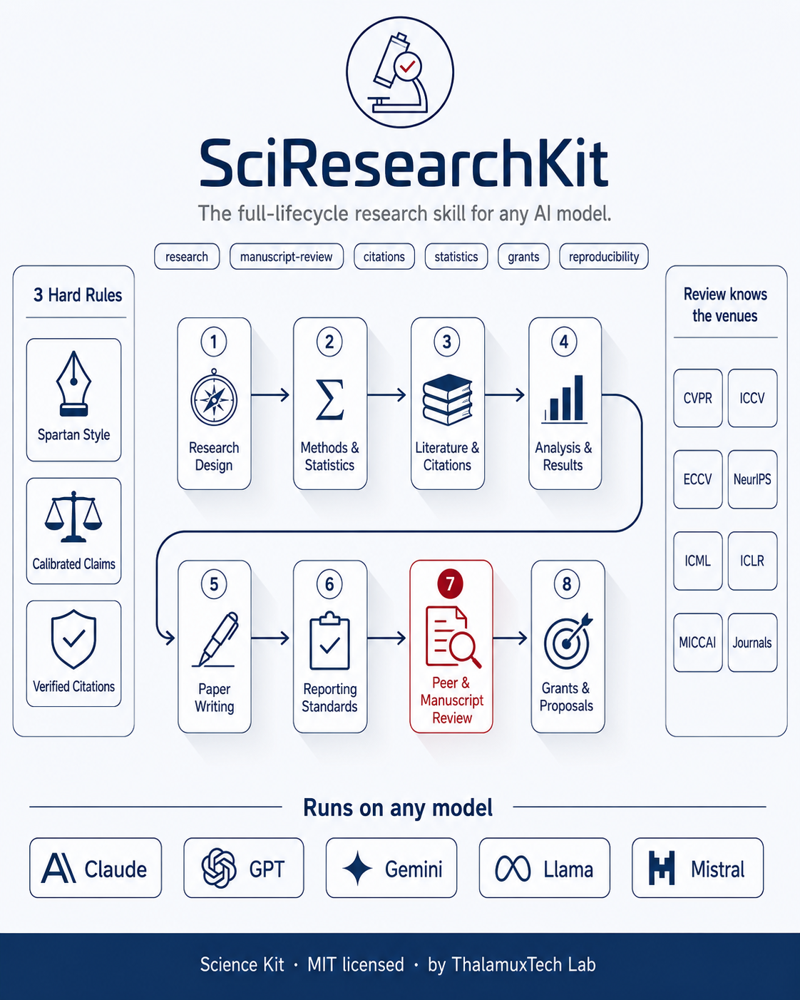

<div align="center">



# SciResearchKit

A model-agnostic Claude skill that turns any capable AI into a rigorous research collaborator. Eight phases, three hard rules, zero runtime.

[](#)
[](#)
[](#compatibility-across-major-ai-models)
[](#the-eight-phases)
[](#license)

`research` · `scientific-writing` · `manuscript-review` · `peer-review` · `citations` · `statistics` · `grants` · `reproducibility` · `systematic-review` · `claude-skill` · `model-agnostic`

</div>

---

## Summary

SciResearchKit gives an AI model one consistent process for scientific work, from the first research question to the final reviewer response. It enforces three rules on every output: a spartan writing style, claims calibrated to the evidence, and citations verified against the claims they support. The whole skill is plain Markdown, so it runs on Claude, GPT, Gemini, Llama, Mistral, and any agent that reads text.

## TL;DR

- One skill covers the full research lifecycle in eight phases.
- Three hard rules stop the three failures that sink papers: weak writing, overconfident claims, and bad citations.
- It ports to every major model. No code runs. No API is required.
- It ships checklists, quality gates, and ready templates.

## Why it exists

Three failures sink research material again and again:

- Authors overstate results. Reviewers reject overconfident claims.
- Citations do not support the sentence they sit on, or do not exist.
- The writing buries the contribution under filler.

SciResearchKit closes each one with a rule and a quality gate that the model runs before it returns work.

## What you get

| Capability | What it does |
|------------|--------------|
| Full lifecycle | Design, methods, literature, analysis, writing, reporting, review, grants |
| Spartan style | Short, active, concrete prose. No filler. No em dashes. |
| Calibrated claims | Language matched to evidence strength on a fixed ladder |
| Citation integrity | Support, existence, and priority tests on every reference |
| Reporting standards | CONSORT, PRISMA, STROBE, ARRIVE, TRIPOD, FAIR |
| Templates | IMRaD paper, response to reviewers, specific aims, preregistration |
| Quality gates | A pass or fail checklist at the end of every phase |

## The eight phases

| # | Phase | Reference file |
|---|-------|----------------|
| 1 | Question and design | `references/research-design.md` |
| 2 | Methods and statistics | `references/methods-and-statistics.md` |
| 3 | Literature and citations | `references/literature-review.md`, `references/citations.md` |
| 4 | Analysis and results | `references/analysis-and-results.md` |
| 5 | Writing the paper | `references/paper-writing.md`, `references/writing-style.md` |
| 6 | Reporting standards | `references/reporting-standards.md` |
| 7 | Peer review and manuscript review | `references/peer-review.md`, `references/manuscript-review.md`, `references/venue-standards.md` |
| 8 | Grants and proposals | `references/grants-and-proposals.md` |

## Compatibility across major AI models

| Platform / Model | How to load | Support |
|------------------|-------------|---------|
| Claude Code | Place the folder in `.claude/skills/`. Auto-loads. | Full |
| Claude API / claude.ai | Paste `SKILL.md` into the system prompt. | Full |
| GPT (ChatGPT, API) | Paste `SKILL.md` as a system or developer message. | Full |
| Gemini | Paste `SKILL.md` into system instructions. | Full |
| Llama, Mistral, open models | Use `SKILL.md` as the system prompt. | Full |
| Cursor, Windsurf | Copy into the project rules file. | Full |
| Codex, Cline, Continue | Add to the agent rules file. | Full |
| MCP clients | Serve `references/` as resources. | Full |

Full load steps and a copy-paste system prompt: `references/portability.md`.

## Get started in 60 seconds

Claude Code:

```
cp -r SciResearchKit ~/.claude/skills/
```

Then ask: "Review my methods section" or "Draft a response to these reviewers". The skill loads by description.

Any other model:

1. Open `SKILL.md`.
2. Paste it into the system prompt.
3. Add the reference file for your phase when you start it.

## How it works

1. The model maps your request to one of the eight phases.
2. It reads the reference file for that phase.
3. It produces the material under the three hard rules.
4. It runs the phase quality gate before returning the result.
5. It reports what it produced, what it assumed, and what stays open.

## Repository structure

```
SciResearchKit/
  SKILL.md                          Router, rules, compatibility matrix
  README.md                         This file
  references/
    writing-style.md                Spartan style contract and banned words
    claims-and-language.md          Evidence-to-language ladder
    citations.md                    Support, existence, priority tests
    research-design.md              Phase 1
    methods-and-statistics.md       Phase 2
    literature-review.md            Phase 3
    analysis-and-results.md         Phase 4
    paper-writing.md                Phase 5
    reporting-standards.md          Phase 6
    peer-review.md                  Phase 7
    manuscript-review.md            Phase 7 (referee protocol)
    venue-standards.md              Phase 7 (CVPR, ICCV, NeurIPS, MICCAI, journals)
    grants-and-proposals.md         Phase 8
    portability.md                  Cross-model load steps
  templates/
    imrad-paper.md
    response-to-reviewers.md
    specific-aims.md
    preregistration.md
```

## The three hard rules

1. Writing style. Clear, spartan, active voice. No em dashes. No banned filler. See `references/writing-style.md`.
2. Claim calibration. The weakest claim the data support. Scientist hedges. See `references/claims-and-language.md`.
3. Citation integrity. Every citation supports its sentence and resolves to a real, recent, top-tier source. See `references/citations.md`.

## When to use, when to skip

Use it for papers, theses, preprints, grants, systematic reviews, and review reports. Skip it for casual summaries and quick factual lookups that need no method, claim calibration, or citation.

## License

MIT.
